# FoodERP Pro Enterprise AI Platform - Updated Entity-Relationship (ER) Database Schema

This document provides a detailed overview of the updated Entity-Relationship (ER) database schema for the FoodERP Pro Enterprise AI Platform, incorporating the requested enhancements for Van Sales & Inventory Reconciliation, the Double Debt system, and advanced GPS Logging.

## 1. ER Diagram Overview

The following Mermaid diagram visually represents the relationships between the various entities in the FoodERP Pro database. This diagram highlights the multi-tenant structure and the interconnectedness of different modules.

```mermaid
%%{init: {'flowchart': {'defaultRenderer': 'elk'}} }%%
erDiagram
    TENANTS ||--o{ ROLES : has
    TENANTS ||--o{ USERS : has
    TENANTS ||--o{ CATEGORIES : has
    TENANTS ||--o{ PRODUCTS : has
    TENANTS ||--o{ WAREHOUSES : has
    TENANTS ||--o{ INVENTORY_STOCKS : has
    TENANTS ||--o{ CUSTOMERS : has
    TENANTS ||--o{ INVOICES : has
    TENANTS ||--o{ COLLECTIONS : has
    TENANTS ||--o{ VEHICLES : has
    TENANTS ||--o{ GPS_ENGINE_LOGS : has
    TENANTS ||--o{ FUEL_LOGS : has
    TENANTS ||--o{ COMMISSION_TIERS : has
    TENANTS ||--o{ COMMISSIONS : has
    TENANTS ||--o{ FRAUD_ALERTS : has
    TENANTS ||--o{ EXPENSES : has
    TENANTS ||--o{ VAN_INVENTORY : has
    TENANTS ||--o{ VAN_LOADS : has
    TENANTS ||--o{ VAN_RECONCILIATIONS : has
    TENANTS ||--o{ SUPPLIERS : has
    TENANTS ||--o{ PURCHASES : has
    TENANTS ||--o{ DEBTS : has

    ROLES ||--o{ USERS : has
    USERS ||--o{ INVOICES : "sales_rep_id"
    USERS ||--o{ COLLECTIONS : "collected_by"
    USERS ||--o{ VEHICLES : "assigned_user_id"
    USERS ||--o{ COMMISSIONS : has
    USERS ||--o{ VAN_LOADS : "requested_by"
    
    CATEGORIES ||--o{ PRODUCTS : has
    PRODUCTS ||--o{ INVENTORY_STOCKS : has
    PRODUCTS ||--o{ INVOICE_ITEMS : has
    PRODUCTS ||--o{ PURCHASE_ITEMS : has
    PRODUCTS ||--o{ VAN_INVENTORY : has
    PRODUCTS ||--o{ VAN_LOAD_ITEMS : has

    WAREHOUSES ||--o{ INVENTORY_STOCKS : has
    WAREHOUSES ||--o{ VAN_LOADS : has

    CUSTOMERS ||--o{ INVOICES : has
    CUSTOMERS ||--o{ DEBTS : has

    INVOICES ||--o{ INVOICE_ITEMS : has
    INVOICES ||--o{ COLLECTIONS : has
    INVOICES ||--o{ COMMISSIONS : has
    INVOICES ||--o{ DEBTS : has

    VEHICLES ||--o{ GPS_ENGINE_LOGS : has
    VEHICLES ||--o{ FUEL_LOGS : has
    VEHICLES ||--o{ VAN_INVENTORY : has
    VEHICLES ||--o{ VAN_LOADS : has
    VEHICLES ||--o{ VAN_RECONCILIATIONS : has

    VAN_LOADS ||--o{ VAN_LOAD_ITEMS : has
    VAN_RECONCILIATIONS ||--o{ USERS : "sales_rep_id"

    SUPPLIERS ||--o{ PURCHASES : has
    SUPPLIERS ||--o{ DEBTS : has

    PURCHASES ||--o{ PURCHASE_ITEMS : has
    PURCHASES ||--o{ DEBTS : has

    TENANTS {
        uuid id PK
        string name
        string domain
        string database_name
        jsonb settings
        boolean is_active
        datetime created_at
        datetime updated_at
        datetime deleted_at
    }

    ROLES {
        uuid id PK
        uuid tenant_id FK
        string name
        string slug
        jsonb permissions
        datetime created_at
        datetime updated_at
    }

    USERS {
        uuid id PK
        uuid tenant_id FK
        string name
        string email
        datetime email_verified_at
        string password
        uuid role_id FK
        string remember_token
        datetime created_at
        datetime updated_at
        datetime deleted_at
    }

    CATEGORIES {
        uuid id PK
        uuid tenant_id FK
        string name
        string slug
        datetime created_at
        datetime updated_at
    }

    PRODUCTS {
        uuid id PK
        uuid tenant_id FK
        uuid category_id FK
        string sku
        string name
        text description
        decimal price
        decimal cost
        integer reorder_level
        jsonb attributes
        datetime created_at
        datetime updated_at
        datetime deleted_at
    }

    WAREHOUSES {
        uuid id PK
        uuid tenant_id FK
        string name
        string location
        datetime created_at
        datetime updated_at
    }

    INVENTORY_STOCKS {
        uuid id PK
        uuid tenant_id FK
        uuid product_id FK
        uuid warehouse_id FK
        integer quantity
        date expiry_date
        datetime created_at
        datetime updated_at
    }

    CUSTOMERS {
        uuid id PK
        uuid tenant_id FK
        string name
        string email
        string phone
        string address
        decimal latitude
        decimal longitude
        decimal current_balance
        datetime created_at
        datetime updated_at
    }

    INVOICES {
        uuid id PK
        uuid tenant_id FK
        uuid customer_id FK
        uuid sales_rep_id FK
        string invoice_number
        decimal total_amount
        decimal total_cost
        decimal discount
        decimal tax
        enum status
        enum payment_type
        datetime created_at
        datetime updated_at
    }

    INVOICE_ITEMS {
        uuid id PK
        uuid invoice_id FK
        uuid product_id FK
        integer quantity
        decimal unit_price
        decimal unit_cost
        decimal subtotal
        datetime created_at
        datetime updated_at
    }

    COLLECTIONS {
        uuid id PK
        uuid tenant_id FK
        uuid invoice_id FK
        uuid collected_by FK
        decimal amount
        datetime collected_at
        datetime created_at
        datetime updated_at
    }

    VEHICLES {
        uuid id PK
        uuid tenant_id FK
        string plate_number
        string model
        uuid assigned_user_id FK
        datetime created_at
        datetime updated_at
    }

    GPS_ENGINE_LOGS {
        uuid id PK
        uuid tenant_id FK
        uuid vehicle_id FK
        boolean engine_status
        datetime event_time
        decimal latitude
        decimal longitude
        enum source_method
        string source_reference
        jsonb raw_data
        datetime created_at
        datetime updated_at
    }

    FUEL_LOGS {
        uuid id PK
        uuid tenant_id FK
        uuid vehicle_id FK
        decimal amount
        decimal liters
        datetime refuel_time
        datetime created_at
        datetime updated_at
    }

    COMMISSION_TIERS {
        uuid id PK
        uuid tenant_id FK
        string name
        decimal min_sales
        decimal max_sales
        decimal percentage
        datetime created_at
        datetime updated_at
    }

    COMMISSIONS {
        uuid id PK
        uuid tenant_id FK
        uuid user_id FK
        uuid invoice_id FK
        decimal amount
        enum status
        datetime created_at
        datetime updated_at
    }

    FRAUD_ALERTS {
        uuid id PK
        uuid tenant_id FK
        string type
        jsonb details
        enum severity
        boolean is_resolved
        datetime created_at
        datetime updated_at
    }

    EXPENSES {
        uuid id PK
        uuid tenant_id FK
        string category
        decimal amount
        text description
        datetime expense_date
        datetime created_at
        datetime updated_at
    }

    VAN_INVENTORY {
        uuid id PK
        uuid tenant_id FK
        uuid vehicle_id FK
        uuid product_id FK
        integer quantity
        datetime created_at
        datetime updated_at
    }

    VAN_LOADS {
        uuid id PK
        uuid tenant_id FK
        uuid vehicle_id FK
        uuid warehouse_id FK
        uuid requested_by FK
        enum status
        datetime created_at
        datetime updated_at
    }

    VAN_LOAD_ITEMS {
        uuid id PK
        uuid van_load_id FK
        uuid product_id FK
        integer quantity
        datetime created_at
        datetime updated_at
    }

    VAN_RECONCILIATIONS {
        uuid id PK
        uuid tenant_id FK
        uuid vehicle_id FK
        uuid sales_rep_id FK
        date reconciliation_date
        decimal total_sales_reported
        decimal total_cash_collected
        decimal total_credit_sales
        decimal variance
        enum status
        text notes
        datetime created_at
        datetime updated_at
    }

    SUPPLIERS {
        uuid id PK
        uuid tenant_id FK
        string name
        string contact_person
        string email
        string phone
        text address
        decimal current_balance
        datetime created_at
        datetime updated_at
    }

    PURCHASES {
        uuid id PK
        uuid tenant_id FK
        uuid supplier_id FK
        string purchase_number
        decimal total_amount
        decimal paid_amount
        enum status
        date purchase_date
        datetime created_at
        datetime updated_at
    }

    PURCHASE_ITEMS {
        uuid id PK
        uuid purchase_id FK
        uuid product_id FK
        integer quantity
        decimal unit_cost
        decimal subtotal
        datetime created_at
        datetime updated_at
    }

    DEBTS {
        uuid id PK
        uuid tenant_id FK
        enum type
        uuid entity_id FK
        uuid reference_id FK
        decimal amount
        decimal remaining_balance
        date due_date
        datetime created_at
        datetime updated_at
    }
```

## 2. Key Enhancements and Relationships

### 2.1. Van Sales & Van Inventory Reconciliation

To support the complex workflow of van sales and ensure accurate inventory tracking and reconciliation, the following tables and relationships have been established:

-   **`van_inventory`**: Tracks the quantity of each product assigned to a specific vehicle. It is linked to `vehicles` and `products`.
-   **`van_loads`**: Records requests for loading stock from a `warehouse` to a `vehicle`, initiated by a `user` (sales representative). Each load can have multiple `van_load_items`.
-   **`van_load_items`**: Details the products and quantities included in a `van_load`.
-   **`van_reconciliations`**: Facilitates end-of-day reconciliation for van sales. It captures reported sales, collected amounts, and calculates variances. It is linked to `vehicles` and `users` (sales representatives).

These tables ensure a complete loop for managing inventory on sales vans, from loading to sales and final reconciliation, providing the necessary data points for analysis and auditing.

### 2.2. Double Debt System (Supplier Debts vs. Customer Debts)

To manage both accounts payable (supplier debts) and accounts receivable (customer debts) comprehensively, a 
unified `debts` ledger has been introduced, along with the necessary supplier and purchase structures:

-   **`suppliers`**: Manages supplier information, including a `current_balance` field to track the overall debt owed to them.
-   **`purchases`**: Records purchase orders from suppliers, linked to `suppliers`.
-   **`purchase_items`**: Details the products and quantities purchased.
-   **`debts`**: A consolidated ledger tracking both `customer_receivable` and `supplier_payable` debts. It uses polymorphic-like fields (`entity_id` and `reference_id`) to link to either `customers`/`invoices` or `suppliers`/`purchases`.
-   **`customers` (Updated)**: A `current_balance` field has been added to the `customers` table to track the overall debt they owe to the company, creating symmetry with the `suppliers` table.

This structure allows for a clear, unified view of all outstanding debts, simplifying financial reporting and management.

### 2.3. Vehicle GPS Logs (Multi-Method Support)

The `gps_engine_logs` table has been enhanced to support the specific requirements for tracking vehicle engine ON/OFF logs, accommodating both Method A (Excel Import) and Method B (Puppeteer Web Scraping):

-   **`source_method`**: An enum field (`excel_import`, `web_scraping`, `api_direct`) indicating how the log entry was acquired.
-   **`source_reference`**: A string field to store the filename for Excel imports or the URL/identifier for web scraping, providing traceability.
-   **`raw_data`**: A JSONB field to store the original payload or raw data from the source, useful for debugging and auditing.

These additions ensure that the system can reliably ingest and track GPS data from various sources, even in the absence of a direct API from the external GPS provider.
